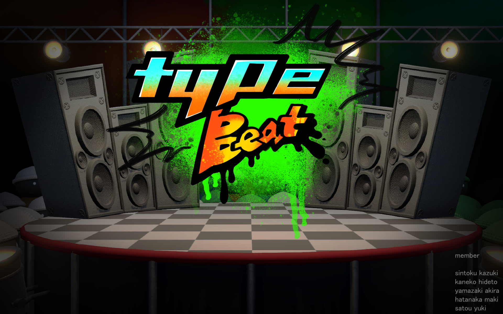

# TypeBeat

## 概要
- 2023年9月12日~13日に開催されたUnity主催のサウンドゲームジャムで作成したタイピングゲーム『TypeBeat』の公開用リポジトリです。
- プログラマーとして制作に参加しました。

### 『TypeBeat』について
- ゲームコンセプト
  　キーボードで奏でる音楽を作るタイピングゲーム

- プラットフォーム
  　OSがWindowsのPC。
  　使用するコントローラーは日本語レイアウトのキーボードです。
  
- 制作期間
  　2023年9月12日~14日（3日間）

- チームメンバー
  　
- 使用したツール

　Unityが主催で開催されたゲームジャムです。サウンドをテーマに２日間でゲームを１つ作り上げます。チームの構成としては、デザイナー、プランナー、プログラマーに人数がランダムで１チーム約５～６人で構成されています。
日程：２０２３年９月１２日（火）～１３日（水）
会場：東京工芸大学中野キャンパス２２０１教室

### 成績
　今回開催されたサウンドゲームジャムでは全体で６チームいました。その中で評価され、`優秀作品`に選ばれました。
