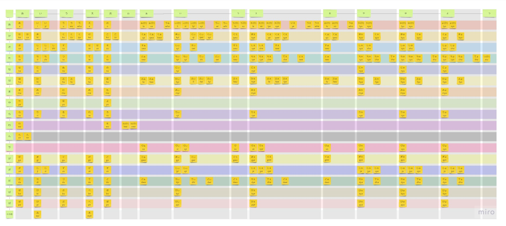
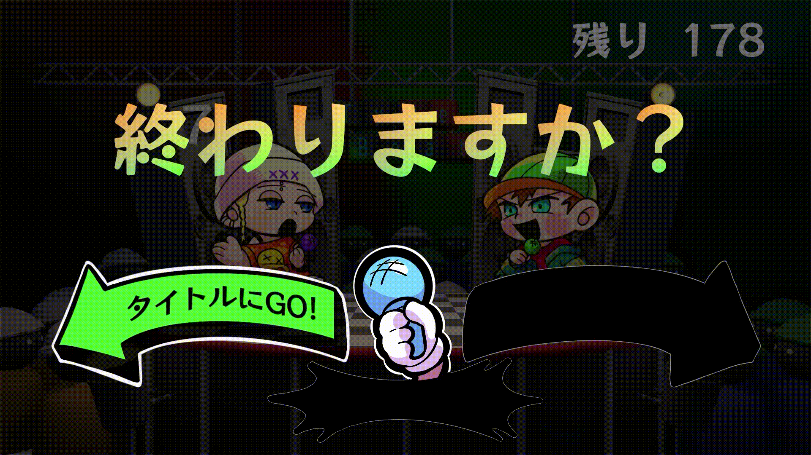

# 担当箇所の紹介
## タイピング
※[【Unity】柔軟な入力に対応したタイピングゲームの作り方（導入編）【C#】](https://qiita.com/AkioMabuchi/items/a7afa292b9e47123b222)を参考にタイピング部分を作成しました。
#### （１）ローマ字入力の例外処理
- ローマ字の全ての打ち方ができるように実装。
- ローマ字の全ての打ち方を自力で探し出しました。

▲ 表示しているローマ字と違うローマ字入力をしている動画（メインゲーム画面）

▲ ローマ字の打ち方を探してまとめた画像

#### （２）制限時間
- １つの言葉を打つ制限時間と１ゲームの制限時間を実装。。
- 左のプレイヤーイラストの左上に表示されているのが１つの言葉を打つ制限時間。
- 画面右上に表示されているのが１ゲームの制限時間。
  
#### （３）文字数の計測
- 表示されているローマ字と同じローマ字を入力をした文字数を計測。
- 表示されているローマ字と違うローマ字を入力した文字数を計測。
- １つの問題を出したときのローマ字の文字数を計測。

## SE、BGM
#### （１）BGMを鳴らす

#### （２）キー入力のSEを鳴らす
- アルファベットごとに音を再生する処理を実装。
#### （３）ボタンを押した時のSEを鳴らす

## UIの演出
#### （１）ボタン拡大縮小する動きの演出
- タイトル画面とリザルト画面のボタンに実装。
- 現在選択中のボタンが拡大縮小の動きをする。
- 選択中ではないボタンは動きがない。

▲ ボタンのUIが拡大縮小している動画（タイトル画面）

#### （２）ボタンUIと黒塗りのUIを切り替える演出
- ポーズ画面に実装。
- 選択中のボタンはUIのイラストが表示される。
- 選択していないボタンは黒塗りのUIが表示される。

▲ UIが切り替わっている動画（ポーズ画面）

#### （４）文字の表示
- メイン画面のゲーム開始時とゲーム終了時に実装。
  
#### （５）カウントダウン
- メイン画面に実装。
  
#### （６）日本語とローマ字の表示演出
- メイン画面に実装。
- 日本語が表示された後、1.2秒後にローマ字が表示される。
  

▲ カウントダウン、文字の表示、日本語とローマ字の表示演出をしている動画（メインゲーム画面）

#### （７）評価
- リザルト画面に実装。
- メインゲーム中に計測した正しく打った文字数、間違えて打った文字数、出題された総文字数を使用し計算し、表示
- 仕様の立案から実装まで行いました。

▲ 文字数からの評価とボタンの演出をしている動画（リザルト画面）

## その他
#### （１）ポーズ画面時の時間処理

#### （２）シーン遷移

